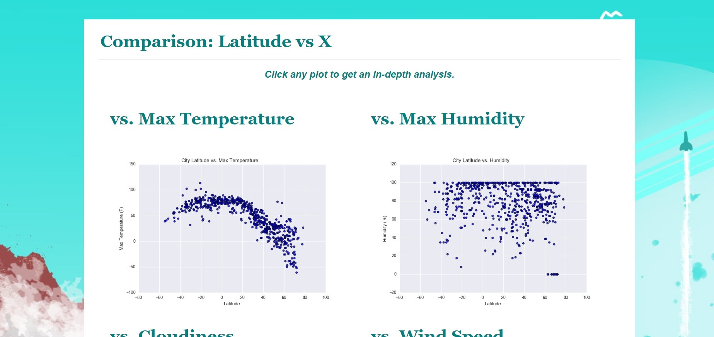
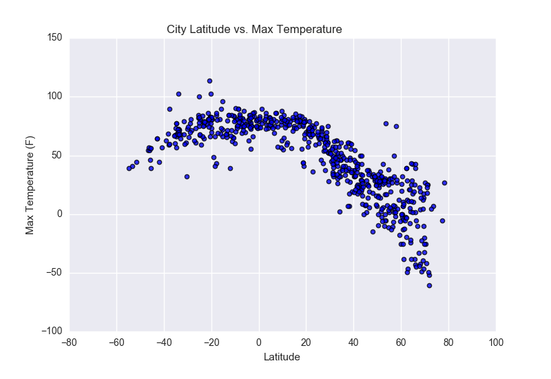
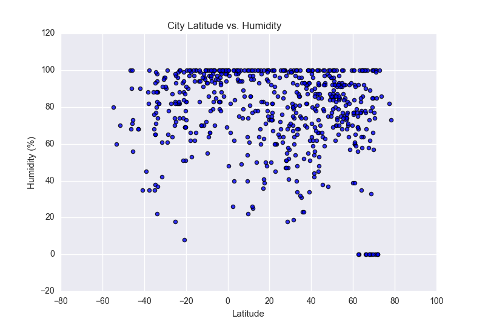
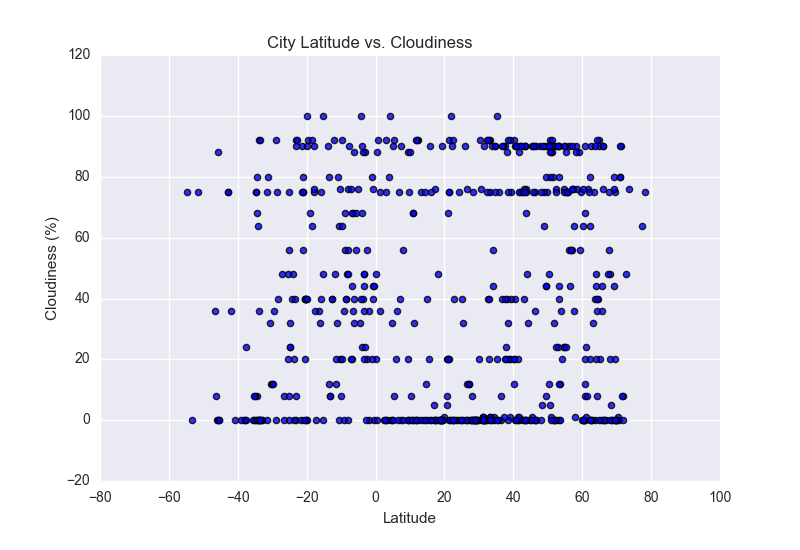
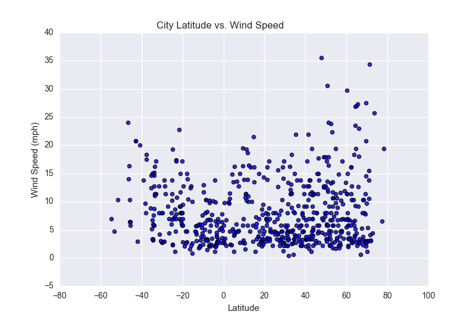

# Web-Design-Challenge

Elvis Selimaj - Web challenge December, 2019

Data is more powerful when we share it with others! Let's take what we've learned about HTML and CSS to create a dashboard showing off the analysis we've done.
Created a new repository for this project called Web-Design-Challenge. 
Cloned the new repository on my computer.
Inside my local git repository, created a directory for the web challenge. Used a folder name corresponded to the challenge: WebVisualizations.
Added html files to this folder as well as your Assets, Resources and visualizations folders.
Pushed the above changes to GitHub. 

